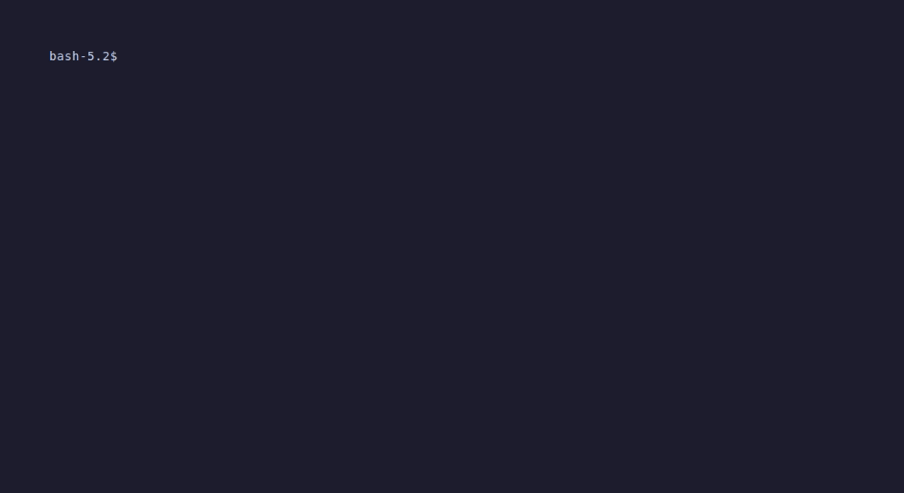

# tfpl - Terraform Polylith CLI

A command-line tool for working with polylith-style Terraform repositories. `tfpl` makes it easy to run terraform/tofu commands on components, bases, and projects organized in a polylith structure.



## Features

- **Simple commands**: Run `init`, `fmt`, `validate`, and `test` on components, bases, or projects
- **Module inspection**: Use `show` to view detailed module information including submodules, tests, and examples
- **Example targeting**: Run commands on specific examples within modules using the `-e` flag
- **Configurable**: Support for both `terraform` and `tofu` via `.tfpl.yml`
- **Test support**: Run terratests or native terraform/tofu tests on modules
- **Smart discovery**: Recursively finds modules in nested subdirectories
- **Clash detection**: Warns when multiple modules share the same name
- **JSON output**: Use `--json` flag with `list` and `show` for scripting

## Installation

### Using go install

```bash
go install github.com/TechnicallyJoe/tfpl@latest
```

### Building from source

```bash
git clone https://github.com/TechnicallyJoe/tfpl.git
cd tfpl
go build -o tfpl .
```

## Requirements

- Go 1.25 or later (for building)
- `terraform` or `tofu` CLI installed and available in PATH

## Usage

### Commands

#### `tfpl init`
Run `terraform init` or `tofu init` on a module:

```bash
tfpl init storage-account       # Init storage-account (searches components, bases, and projects)
tfpl init k8s-argocd           # Init k8s-argocd
tfpl init storage-account -e basic  # Init the 'basic' example of storage-account
```

#### `tfpl fmt`
Run `terraform fmt` or `tofu fmt` on a module:

```bash
tfpl fmt storage-account       # Format storage-account
tfpl fmt k8s-argocd           # Format k8s-argocd
tfpl fmt -i storage-account   # Init then format storage-account
tfpl fmt storage-account -e basic  # Format the 'basic' example
```

#### `tfpl val` (or `validate`)
Run `terraform validate` or `tofu validate` on a module:

```bash
tfpl val storage-account       # Validate storage-account
tfpl validate k8s-argocd      # Validate k8s-argocd
tfpl val -i spacelift-modules # Init then validate spacelift-modules
tfpl val storage-account -e basic  # Validate the 'basic' example
```

#### `tfpl test`
Run tests on a module using the configured test engine (terratest by default):

```bash
tfpl test storage-account           # Run tests on storage-account
tfpl test storage-account -a -v     # Run tests with verbose output
tfpl test storage-account -a -timeout=30m  # Run tests with custom timeout
```

The test command uses the configured test engine (default: terratest) to run tests. For terratest, this executes `go test ./...` in the module directory. Tests should be defined within each module directory.

#### `tfpl config`
Show current configuration:

```bash
tfpl config
```

Output:
```
Current configuration:
  Root:   iac
  Binary: terraform

Test configuration:
  Engine: terratest
  Args:   (none)
```

#### `tfpl show`
Show detailed information about a module:

```bash
tfpl show storage-account      # Show details for storage-account
tfpl show --path ./my-module   # Show details for module at explicit path
tfpl show storage-account --json  # Output as JSON for scripting
```

Output:
```
Name:                  storage-account
Type:                  component
Path:                  components/azurerm/storage-account
Spacelift Version:     1.2.3
Has Submodules:        No
Has Tests:             Yes
Has Examples:          Yes

Examples:
  - basic (components/azurerm/storage-account/examples/basic)

Tests:
  - basic_test.go (components/azurerm/storage-account/tests/basic_test.go)
```

#### `tfpl list`
List all modules in the repository:

```bash
tfpl list                    # List all modules
tfpl list -s storage         # Filter modules containing "storage"
tfpl list -s *account*       # Filter with wildcards
tfpl list --json             # Output as JSON for scripting
```

### Flags

| Flag | Short | Description |
|------|-------|-------------|
| `--path` | | Explicit path (mutually exclusive with module name) |
| `--init` | `-i` | Run init before the command (for `fmt` and `val`) |
| `--example` | `-e` | Run on a specific example instead of the module (for `init`, `fmt`, `val`) |
| `--args` | `-a` | Extra arguments to pass to terraform/tofu (can be specified multiple times) |
| `--search` | `-s` | Filter modules using wildcards (for `list`) |
| `--json` | | Output in JSON format (for `list` and `show`) |
| `--version` | `-v` | Show version |
| `--help` | `-h` | Show help |

### Examples

```bash
# Format a component
tfpl fmt storage-account

# Validate a base (with init first)
tfpl val -i k8s-argocd

# Run commands on a specific example
tfpl init storage-account -e basic
tfpl val -i storage-account -e basic

# Run tests on a module
tfpl test storage-account

# Run tests with additional arguments
tfpl test storage-account -a -v -a -timeout=30m

# Use explicit path
tfpl fmt --path iac/components/azurerm/storage-account

# Init a project
tfpl init spacelift-modules

# Pass extra arguments
tfpl init storage-account -a -upgrade -a -reconfigure

# Show module details
tfpl show storage-account
tfpl show storage-account --json

# List all modules
tfpl list
tfpl list -s *storage* --json

# Show version
tfpl -v
```

## Configuration File

Create a `.tfpl.yml` file in your repository root to configure `tfpl`:

```yaml
# The root directory containing the polylith structure (components, bases, projects)
# Default: "" (repository root)
root: iac

# The Terraform binary to use: "terraform" or "tofu"
# Default: "terraform"
binary: terraform

# Test configuration
test:
  # Test engine to use: "terratest", "terraform", or "tofu"
  # Default: "terratest"
  engine: terratest

  # Additional arguments passed to the test command
  # For terratest: these are passed to "go test ./... <args>"
  # For terraform/tofu: these are passed to "terraform test <args>"
  # Default: ""
  args: ""
```

### Configuration Options

| Option | Type | Default | Description |
|--------|------|---------|-------------|
| `root` | string | `""` | Directory containing components/bases/projects (relative to repo root) |
| `binary` | string | `"terraform"` | Binary to use: `"terraform"` or `"tofu"` |
| `test.engine` | string | `"terratest"` | Test engine: `"terratest"`, `"terraform"`, or `"tofu"` |
| `test.args` | string | `""` | Additional arguments passed to the test command |

The configuration file is optional. If not present, `tfpl` will use default values (empty root, "terraform" binary, "terratest" engine).

## Expected Directory Structure

`tfpl` expects a polylith-style repository structure:

```
repository-root/
├── .tfpl.yml              # Configuration file (optional)
└── iac/                   # Root directory (if configured as "root: iac")
    ├── components/
    │   ├── aws/
    │   │   └── s3-bucket/
    │   └── azurerm/
    │       ├── storage-account/
    │       └── naming/
    ├── bases/
    │   ├── azsloth/
    │   └── azsloth-docker-translator/
    └── projects/
        └── spacelift-modules/
```

Each module directory (component, base, or project) should contain at least one `.tf` or `.tf.json` file.

## Edge Cases

### Nested Subfolders

`tfpl` recursively searches for modules in nested subdirectories. For example:

```
iac/components/
├── azurerm/
│   ├── storage-account/
│   └── naming/
└── aws/
    └── s3-bucket/
```

You can refer to modules by name regardless of their nesting:

```bash
tfpl fmt storage-account  # Finds iac/components/azurerm/storage-account
tfpl fmt s3-bucket       # Finds iac/components/aws/s3-bucket
```

### Name Clashes

If multiple modules share the same name in different locations, `tfpl` will detect the clash and provide a helpful error:

```
Error: multiple modules named 'naming' found - name clash detected:
  1. /path/to/repo/iac/components/azurerm/naming
  2. /path/to/repo/iac/components/aws/naming

Please use --path to specify the exact path
```

To resolve this, use the `--path` flag with an explicit path:

```bash
tfpl fmt --path iac/components/azurerm/naming
```

### Module Type Detection

`tfpl` automatically searches for modules across all three directories (components, bases, and projects). You don't need to specify the module type - just provide the name:

```bash
tfpl fmt storage-account  # Searches in components, bases, and projects
tfpl val k8s-argocd      # Automatically finds it in bases/
tfpl init prod-infra     # Automatically finds it in projects/
```

### Mutual Exclusivity

The following combinations are not allowed:

- Cannot use `--path` together with a module name argument

Example error:

```bash
tfpl fmt storage --path iac/components/storage
# Error: --path is mutually exclusive with module name argument
```

## Development

### Running Tests

```bash
go test ./...
```

### Building

```bash
go build -o tfpl .
```

## Releases

Releases are automated via [GoReleaser](https://goreleaser.com/) when a version tag is pushed.

### Creating a Release

```bash
git tag v1.0.0
git push origin v1.0.0
```

This triggers the release workflow which:
- Builds binaries for Linux, macOS, and Windows (amd64/arm64)
- Creates a GitHub Release with changelog
- Uploads binaries and checksums

### Download

Download the latest release from the [Releases page](https://github.com/TechnicallyJoe/tfpl/releases).

## CI/CD

This project uses GitHub Actions for continuous integration:

| Workflow | Purpose |
|----------|---------|
| **CI** | Runs on every push/PR: linting, security scanning, tests, build |
| **Release** | Triggered on version tags: builds and publishes releases |
| **CodeQL** | Weekly security analysis |
| **Dependabot** | Automated dependency updates |

### Security

- **govulncheck**: Scans Go dependencies for known vulnerabilities
- **gosec**: Static security analysis via golangci-lint
- **CodeQL**: Deep security analysis (weekly)

## Contributing

Contributions are welcome! Please feel free to submit a Pull Request.

### Commit Message Convention

This project uses [Conventional Commits](https://www.conventionalcommits.org/) for clear history and automated changelogs:

```
<type>(<scope>): <description>

[optional body]
```

**Types:**
| Type | Description |
|------|-------------|
| `feat:` | New feature |
| `fix:` | Bug fix |
| `docs:` | Documentation changes |
| `chore:` | Maintenance tasks |
| `refactor:` | Code refactoring |
| `test:` | Adding or updating tests |

**Examples:**
```
feat(tasks): add support for custom shell configuration
fix(finder): handle symlinks in module discovery
docs: update README with CI/CD instructions
chore(deps): update cobra to v1.9.0
```

### Development Workflow

1. Fork the repository
2. Create a feature branch (`git checkout -b feat/my-feature`)
3. Make your changes with conventional commit messages
4. Run tests (`go test ./...`)
5. Submit a Pull Request

## License

This project is licensed under the MIT License - see the [LICENSE](LICENSE) file for details.
